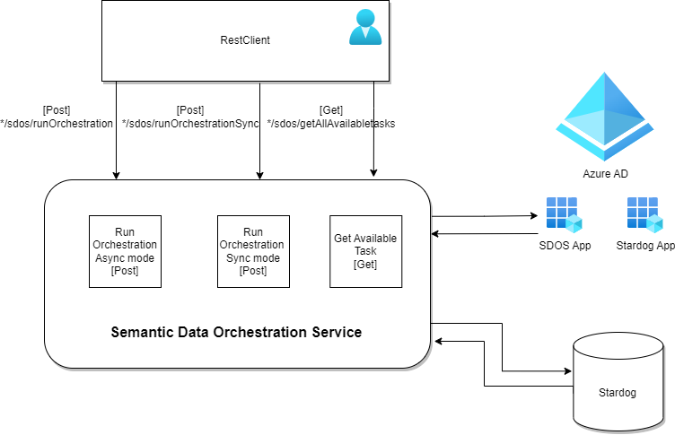

# SDOS

Semantic Data Orchestration Service. This service is used for running orchestration flow graph and store the rdf data 
to Stardog.

## System Components



Semantic Data Orchestration service is an application which makes api calls to different systems, then combine the data 
and transform it into knowlegde graph. It help to achieve the process of ETL, that is Extract-Transform-Load. It 
executes the flow based on OFG(Orchestration Flow Graph). OFG has instances of Orchestration Ontology(OO - model which 
defines rules, options and restriction to create flow 
graphs). These flow graph instance can be executed to get data from specific systems and transform the data to knowledge
graph(rdf) and store it in a result graph. 

It is integrated with Microsoft Entra ID(Azure AD) to support SSO(Single-SignOn). So user can use their AD credentials to access 
the application. SDOS also supports the Azure AD OBO flow(On-behalf Of) to access the triple store(Stardog DB).

[Video explanation](https://github.com/scania/sdos/tree/main/doc/resources)

## How does SDOS work?
* when SDOS receives the request, first it validates the token. Token will be verified using the signature. Once the token
  has been verified, it fetches the OBO token for accessing Stardog.  

* Using the OBO token SDOS calls Stardog to read the OFG. SDOS uses the subject iri in the request to fetch the OFG.

* It starts the execution based on OFG.

* Finally push the tranformed RDF data into Stardog Named graph. It also returns the transformed RDF data in requested format as response, if the request is made for synchronous endpoint. 

**(The value of database where the OFG's are stored and the database where it pushes the data into Stardog and Azure AD details can 
be configured by passing the values as environment variable)**

## Prerequisites

- Java jdk 17 (for building and running the application)
- Stardog >= 9.x (RDF db for saving the knowledge graph)
- Github (to download the source code)
- Gradle 7.4.2 (to build jar file)
- Azure AD (to support SSO)
- SpringBoot 3.2.2

# QuickStart
## Technical Note

Create Azure App for both SDOS & Stardog. Create [Stardog Azure App](https://github.com/Stardog-union/launchpad-docs/blob/main/azure/access-token-passthrough-mode.md#how-to-register-the-Stardog-application) as mobile application in Azure. Register SDOS App as client 
application with required scopes in Stardog App. Then add User in both SDOS App and Stardog 
App with required roles. Upload flow graph in Named Graph(in ofg database). Example Flow Graph can be found [here](https://github.com/scania/sdos-orchestration-flow-graph/blob/main/Pizza/OFG_Pizza.ttl). 
Make sure Stardog supports OIDC and also enable these option for Stardog Databases. Example SDOS request postman collection for Pizza usecase can be found [here](https://github.com/scania/sdos/tree/main/src/main/resources/pizza_request.postman_collection)

* security.named.graphs: false
* query.all.graphs: true
* search.enabled: true
## Building

1. Clone the project from github.

   ```
   git clone https://github.com/scania/sdos.git
   ```

2. Go to the root of the project

   ```	
   cd sdos
   ```

3. Update submodules

   ```
   git submodule update --init --recursive
   ```

4. Run gradle, a gradle binary is included in the project, so you don't need to download it
   yourself.

   ```
   ./gradlew build
   ```

5. The binary should now have been built and popped up in the
   folder `{your_project_root}/build/libs`.

## Running

Run it as any other jar file to get the usage output:

	java -jar {your_project_root}/build/libs/sdos.jar -h

This should produce the following output:

    
      usage: sdos -b <arg> -clientScope <arg> -clientSecret <arg> [-h] [-id <arg>] -ofg <arg> -r <arg> -tenantId <arg> [-tpSize <arg>]
      -b,--stardogBaseUrl <arg>                 the baseUrl for a stardog endpoint, this option is mandatory.
      -clientScope,--stardogClientScope <arg>   Stardog client scope that SDOS can use for token exchange, this option is mandatory.
      -clientSecret,--sdosClientSecret <arg>    SDOS Azure app client secret used for Azure communication, this option is mandatory.
      -h,--help                                 Show the information about the arguments
      -id,--serviceId <arg>                     A unique identifier for this service, this option is mandatory.
      -ofg,--ofgDb <arg>                        A unique identifier for orchestration database name in stardog, this option is mandatory.
      -r,--resultDb <arg>                       A unique identifier for result database name in stardog, this option is mandatory.
      -tenantId,--azureTenantId <arg>           Tenant id used for Azure communication, this option is mandatory.
      -tpSize,--threadPoolSize <arg>            the thread pool size to initialize the Thread Executor, this option is optional.


### Arguments

All Arguments will be listed below. Not all arguments are mandatory for the service to run but may
be needed for special cases and needs.

| Program Argument   | MANDATORY               | Description                                                                                                                       | Allowed Values       |
|--------------------|-------------------------|-----------------------------------------------------------------------------------------------------------------------------------|----------------------| 
| StardogBaseUrl     | True                    | The base-url of Stardog.                                                                                                          | a url                |
| StardogClientScope | True                    | Stardog client scope where SDOS is registered with to get OBO token                                                               | Stardog Client scope |
| sdosClientSecret   | True                    | SDOS Client Secret used to fetch OBO token for Stardog                                                                            | Azure App secret     |
| serviceId          | True                    | A unique identifier for this service.                                                                                             | a unique name        |
| ofgDb              | True                    | The name of Orchestration database name.                                                                                          | a unique name        |
| resultDb           | True                    | The name of result database name.                                                                                                 | a unique name        |
| azureTenantId      | True                    | Tenant id used for Azure communication                                                                                            | Azure tenant id      |
| threadPoolSize     | True                    | The thread pool size to initialize the Thread Executor                                                                            | number               | 


Follow the usage and provide mandatory arguments. 

   Ex. java -jar sdos.jar -id SDOS -b <Stardog_Base_url> -ofg <ofg_db_name> -r <result_db_name> -tpSize <threadpool_size> -clientSecret <sdos_clientsecret> -clientScope <clientScope_Stardog> -tenantId <azure_tenant_id>

The application should now start.

After the application is up and running the swagger doc can be found
at http://localhost:8050/sdos/swagger-ui.html

## Support

If you face any issues, find any bugs or have any questions regarding the application the SDOS
development team is available through mail [sdos@scania.com](mailto:sdos@scania.com)


[Community Page](https://github.com/scania/sdos/discussions) is also available for the discussion.

## Quick links

[Register App in Azure Active Directory](https://learn.microsoft.com/en-us/entra/identity-platform/quickstart-register-app)

[OBO Flow](https://learn.microsoft.com/en-us/entra/identity-platform/v2-oauth2-on-behalf-of-flow)

[Token signature validation](https://www.voitanos.io/blog/validating-entra-id-generated-oauth-tokens/)

[Stardog github for setting up Azure](https://github.com/Stardog-union/launchpad-docs/blob/main/azure/access-token-passthrough-mode.md#how-to-register-the-Stardog-application)


## License
SDOS is licensed under [Affero General Public License 3.0](https://github.com/scania/sdos/blob/main/LICENSE) 